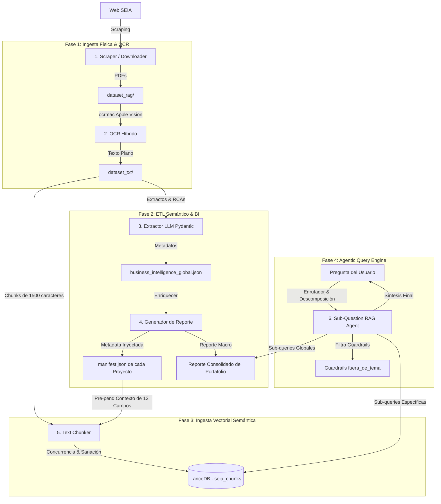

# 🏗️ Arquitectura Técnica y Decisiones de Ingeniería: SEIA Minería RAG

Este documento describe la arquitectura técnica de extremo a extremo, los desafíos de diseño y las decisiones de ingeniería detrás del sistema de RAG Agéntico e Inteligencia de Negocio construido para procesar y consultar los expedientes del **Sistema de Evaluación de Impacto Ambiental (SEIA)** de minería en Chile.

---

## 📊 1. Mapa de la Arquitectura Global

El pipeline está diseñado de manera modular para separar la ingesta y estructuración de datos de la lógica conversacional del agente:

---

## ⚙️ 2. Análisis Profundo de las Fases del Pipeline

### Fase 1: Ingesta Física y OCR Híbrido
* **El Reto:** Los expedientes del SEIA constan de miles de PDFs de resoluciones ambientales (RCAs) e informes técnicos. Muchos de ellos son documentos escaneados antiguos que no contienen una capa de texto nativa seleccionable.
* **La Solución:** Un motor de extracción híbrido. Utiliza `PyMuPDF` para extraer texto nativo directamente si existe. Si el PDF es detectado como una imagen pura, invoca automáticamente la API **ocrmac** (basada en el framework Apple Vision a nivel de sistema operativo).
* **Decisión Clave:** El motor OCR preserva las tildes y la letra ñ del idioma español, esenciales para que las búsquedas semánticas posteriores no pierdan calidad por distorsiones ortográficas.

### Fase 2: ETL Semántico e Inteligencia de Negocio
* **El Reto:** Los sistemas RAG tradicionales fallan críticamente al responder preguntas agregadas (por ejemplo, *"¿Cuál es la inversión total del portafolio?"*). El sistema recupera fragmentos al azar pero no puede consolidar, sumar ni filtrar.
* **La Solución:** Creamos una fase de estructuración previa de datos (ETL Semántico) usando `extractor_negocio.py` y `generador_documento_dorado.py`:
  1. **Structured Outputs:** Forzamos a `gpt-4o-mini` a leer los extractos de cada proyecto y extraer una estructura estricta en JSON a través de un esquema **Pydantic** de 13 campos clave (inversión, comunas, obras, focos de impacto, etc.).
  2. **Reporte Consolidado (Documento Dorado):** Los datos individuales se consolidan en tablas agregadas mediante algoritmos tradicionales en Python (Pareto 80/20 de inversión, distribución mineral por macro-zona, costo comparativo de desaladoras). Un LLM sintetiza los hallazgos en un archivo Markdown compacto de ~400 líneas.
  3. **Inyección en Manifests:** Inyectamos los datos de negocio y la información de la RCA (número de resolución, fecha de emisión, régimen legal) de vuelta en el `manifest.json` de cada proyecto.

### Fase 3: Ingesta Vectorial y Base de Datos (LanceDB)
* **Contextual Retrieval (Pre-pend de Metadatos):** Si dividimos un documento de 1.000 páginas en pequeños chunks de texto sueltos, la IA pierde el contexto general al recuperar un fragmento intermedio. Para solucionarlo, el `ingest_vector_db.py` **antepone un encabezado de contexto estructurado** a cada chunk antes de vectorizarlo:
  `[Proyecto: X | Titular: Y | Región: Z | RCA N°: A (Fecha)] Resumen de la Obra... \n\n Texto del Expediente: ...`
* **Desafío Técnico de Tasa de Tokens (TPM):** Con un dataset de **149.341 fragmentos** (~192 MB de texto), procesar embeddings de forma secuencial tardaría más de 30 minutos. Al paralelizar la ingesta con 16 hilos concurrentes, chocamos contra el límite de TPM (1.000.000 de tokens por minuto) de la API de OpenAI, lo que provocó errores HTTP 429 y dejó un 71% de vectores vacíos (en cero).
* **Mecanismo de Autocuración (`heal_vector_db.py`):** Diseñamos un script curativo que detecta los vectores en cero, y vuelve a solicitar los embeddings correspondientes limitando la cola a **3 hilos concurrentes** usando **backoff exponencial** (`tenacity`). Redujo los vectores fallidos a **0.00%**.
* **LanceDB como Base de Datos Vectorial:** En lugar de utilizar bases de datos con servidores activos pesados como Chroma o motores en contenedores Docker, elegimos **LanceDB** debido a su naturaleza **serverless** (almacenada en un directorio de archivos locales como SQLite) y su integración nativa con esquemas rígidos de **PyArrow** en Python. Esto la hace óptima para portafolios web gratuitos y de fácil despliegue.

### Fase 4: Motor de Consulta Agéntico (Sub-Question Query Engine)
Para responder preguntas compuestas complejas sin forzar la lectura completa del Reporte Macro en cada prompt, implementamos un motor de consulta con descomposición en [rag_agent.py](file:///Users/fernandobarreragutierrez/projects/seia_rag/scraper/rag_agent.py):
1. **Descomposición:** Un LLM clasifica la consulta del usuario. Si es compuesta, la divide en una lista de sub-consultas atómicas.
2. **Enrutamiento (Routing):** El agente analiza el alcance de cada sub-consulta:
   * **Categoría `"global"`:** Se responde consultando el Reporte Consolidado del Portafolio completo en disco.
   * **Categoría `"especifico"`:** Se responde generando el embedding y consultando por similitud en **LanceDB**.
3. **Paralelismo:** Las sub-consultas se ejecutan concurrentemente con hilos para minimizar la latencia.
4. **Síntesis:** Un consolidador final con **GPT-4o** recibe los resultados y los unifica en una respuesta única para el usuario.

---

## 🛡️ 3. Guardrails e Integridad de Datos (Zero-Leak)

### Clasificación de Fuera de Tema (`fuera_de_tema`)
Para evitar que el agente rompa su rol de consultor del SEIA ante preguntas ajenas al dominio (ej: *"¿Cuál es el clima en Viña del Mar?"* o *"Escribe un poema"*):
* El enrutador analiza la consulta y, si no tiene relación con minería, variables ambientales o inversión, le asigna la categoría **`"fuera_de_tema"`**.
* El agente **aborta inmediatamente** cualquier llamada al motor de búsqueda o a LanceDB, devolviendo una respuesta de rechazo estandarizada y profesional. Esto ahorra costos de API y bloquea inyecciones de prompts maliciosas.

### Ocultamiento de la Abstracción (Zero-Leak)
Modificamos los prompts de síntesis para prohibir al modelo el uso de jergas de desarrollo de software internas. El agente nunca mencionará términos como:
* *Documento Dorado*
* *Chunks / Fragmentos*
* *Base de datos vectorial / LanceDB*
* *RAG*

Para el usuario final, el asistente actúa como un consultor humano con acceso directo y estructurado a los expedientes del SEIA.

---

### Reranking Agéntico (RankGPT)
Para resolver problemas de **Compleción (Completeness/Recall)** en las respuestas específicas (como la pérdida de datos como la frecuencia de monitoreo en la primera fase de búsqueda):
* **Búsqueda Vectorial Ampliada (k=15 a 25):** Recuperamos los fragmentos más relevantes de LanceDB (hasta 15 para consultas específicas y 25 para listas) para maximizar la cobertura del contexto.
* **LLM Reranker:** Enviamos una lista simplificada de hasta 15 fragmentos a `gpt-4o-mini` con un formato estructurado (Pydantic `RerankedIndices`) pidiéndole seleccionar los 6 fragmentos específicos con mayor densidad de información para responder la consulta del usuario.
* **Resultados:** Esto filtra el ruido y reduce al mínimo las alucinaciones por falta de contexto útil, combinando la velocidad de la búsqueda vectorial con el razonamiento del LLM.

---

## 📊 4. Matriz de Decisiones y Trade-offs

| Dimensión | Opción Elegida | Alternativa Evaluada | Razón del Trade-off |
|---|---|---|---|
| **Base Vectorial** | **LanceDB** | **ChromaDB** | Evita compilar librerías nativas C++ que fallan en Apple Silicon. Es 100% portable y serverless. |
| **Búsqueda Vectorial** | **Exacta (Matrix Dot Product)** | **Aproximada (ANN Graph)** | A la escala del portafolio (150k chunks), la multiplicación exacta de NumPy toma menos de 10ms y garantiza no perder información por aproximación. |
| **Embeddings Model** | **text-embedding-3-small** | **text-embedding-3-large** | El modelo *small* (1536 dim) es 6.5 veces más barato, consumiendo la mitad de la RAM en el servidor web sin pérdidas significativas de rendimiento semántico. |
| **Procesamiento RAG** | **Sub-Question Engine** | **Contexto Mixto Directo** | Descomponer las preguntas compuestas permite buscar paralelamente en motores específicos, reduciendo alucinaciones y entregándole al LLM solo la información refinada. |
| **Reranking** | **LLM Reranker (RankGPT)** | **Sin Reranking / Rerank externo** | Buscar k=15 y filtrar con LLM a top-6 en un paso intermedio previene la pérdida de detalles específicos del expediente sin incurrir en costos de APIs externas de reranking. |
